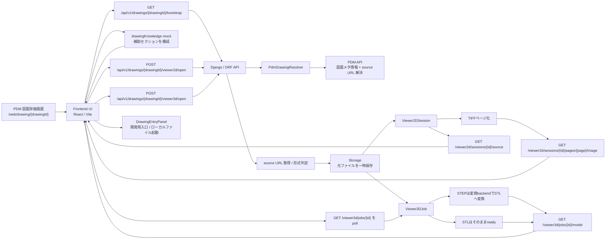
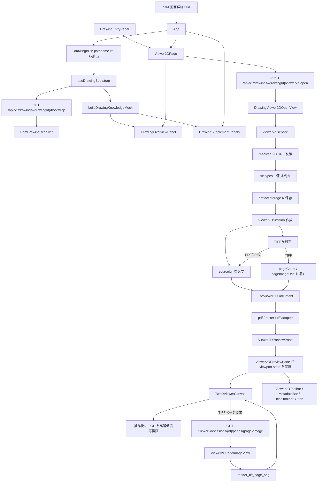
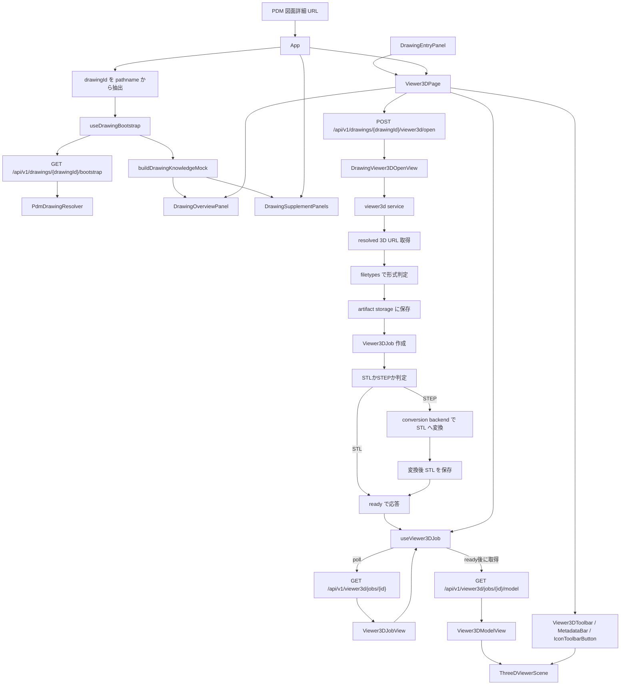

# 2D/3D PDM Embedded Viewer データフロー

## コンセプト

この viewer は、PDM の図面詳細画面から受け取った `drawingId` を起点に、PDM API で図面メタ情報と 2D/3D ソースを解決し、既存ナレッジ画面に近い詳細 UI で軽量に閲覧することだけに責務を絞っています。業務ロジックそのものは持たず、表示に必要な取得・変換・保存・配信を担当します。

## 全体像

## 役割分担

- PDM
  - `/web/drawing/{drawingId}` の画面導線を持つ
  - viewer には `drawingId` だけを渡す
- フロントエンド
  - drawingId の解析、bootstrap 読み込み、ナレッジ風詳細 UI の構成、2D/3D の描画を担当する
- バックエンド
  - PDM API 解決、形式判定、TIFF ページ化、STEP 変換、成果物配信を担当する
- Storage
  - 取得元ファイルと変換済みファイルを一時保存する
- Conversion Backend
  - STEP を表示用 STL へ変換する

## 2D 詳細図

## 2D の流れ

1. PDM 画面上で viewer が `/drawing/{drawingId}` として開く
2. フロントエンドが `drawingId` を解析し、`GET /api/v1/drawings/{drawingId}/bootstrap` を呼ぶ
3. バックエンドが PDM API を呼んで図面メタ情報と 2D availability を解決する
4. フロントエンドが bootstrap から基本情報を描き、不足する補助セクションは mock detail で構成する
5. 開発画面では `DrawingEntryPanel` からローカルファイルを選び、拡張子で 2D/3D を自動判定して詳細画面へ入る
6. フロントエンドが `POST /api/v1/drawings/{drawingId}/viewer2d/open` または `POST /api/v1/viewer2d/upload` を呼ぶ
7. バックエンドが 2D ソースまたは upload ファイルを形式判定し、`Viewer2DSession` を作成する
8. TIFF の場合はページ数を取得し、各ページ画像 URL を返す
9. フロントエンドは `Viewer2DPreviewPane` で viewport state を持ち、toolbar と canvas の双方からズーム・回転・リセットを制御する
10. `TwoDViewerCanvas` は pointer 入力を使ってパンを処理し、ホイールズームではカーソル位置をアンカーにして offset を補正する
11. `sourceUrl` を読み込み、形式ごとの adapter で描画を開始する
12. PDF は表示幅ベースの描画に加え、操作終了後に高解像度描画へ差し替える

## 3D 詳細図

## 3D の流れ

1. フロントエンドが bootstrap で 3D availability を確認する
2. フロントエンドが bootstrap から基本情報を描き、不足する補助セクションは mock detail で構成する
3. 開発画面では `DrawingEntryPanel` からローカルファイルを選び、拡張子で 2D/3D を自動判定して詳細画面へ入る
4. 3D タブを開いたタイミングで `POST /api/v1/drawings/{drawingId}/viewer3d/open` または `POST /api/v1/viewer3d/upload` を呼ぶ
5. バックエンドが解決済み 3D URL または upload ファイルを形式判定し、`Viewer3DJob` を作成する
6. STL はそのまま ready にし、STEP は conversion backend で STL に変換する
7. フロントエンドは `GET /api/v1/viewer3d/jobs/{id}` を poll して job 状態を追う
8. ready になったら `GET /api/v1/viewer3d/jobs/{id}/model` のモデルを `ThreeDViewerScene` へ渡して描画する
9. 3D のズーム・リセット・断面操作はプレビュー右上の `Viewer3DToolbar` から Scene へ伝播する

## 画面と API の対応

- 画面入口: `frontend/src/App.tsx`
- 開発用入口: `frontend/src/shared/components/DrawingEntryPanel.tsx`
- drawingId 解析: `frontend/src/shared/drawingRoute.ts`
- bootstrap 読み込み: `frontend/src/shared/hooks/useDrawingBootstrap.ts`
- mock detail 構成: `frontend/src/shared/mock/drawingKnowledge.ts`
- 基本情報カード: `frontend/src/shared/components/DrawingOverviewPanel.tsx`
- 補助セクション: `frontend/src/shared/components/DrawingSupplementPanels.tsx`
- 操作アイコン: `frontend/src/shared/components/IconToolbarButton.tsx`
- 2D 画面: `frontend/src/features/viewer2d/pages/Viewer2DPage.tsx`
- 3D 画面: `frontend/src/features/viewer3d/pages/Viewer3DPage.tsx`
- drawing 解決: `backend/apps/viewer/services/pdm.py`
- drawing API 入口: `backend/apps/viewer/api/views.py`

## なぜこの分離か

- PDM 側の変更を `drawingId を渡す` だけに抑えるため
- PDM API 解決の責務を backend へ閉じ込め、frontend を描画に集中させるため
- 既存ナレッジ画面に近い見た目を、実データと mock detail を分けて保守しやすくするため
- TIFF と STEP の特殊処理を viewer ごとの service / adapter に閉じ込め、公開 API を薄く保つため
- API と画面の責務境界を人力で追いやすくするため
